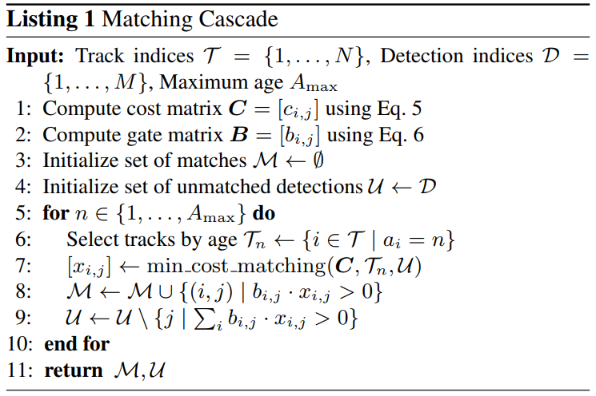
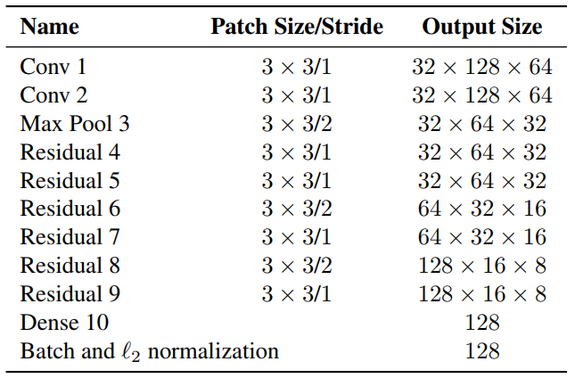
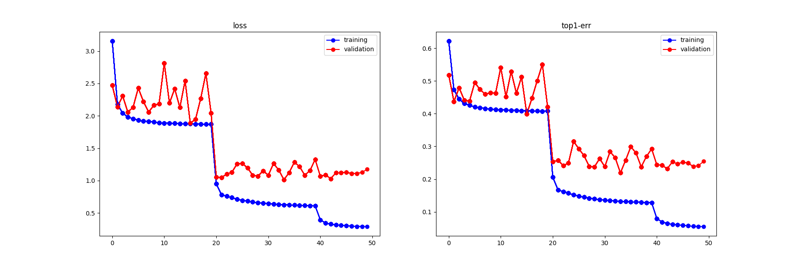
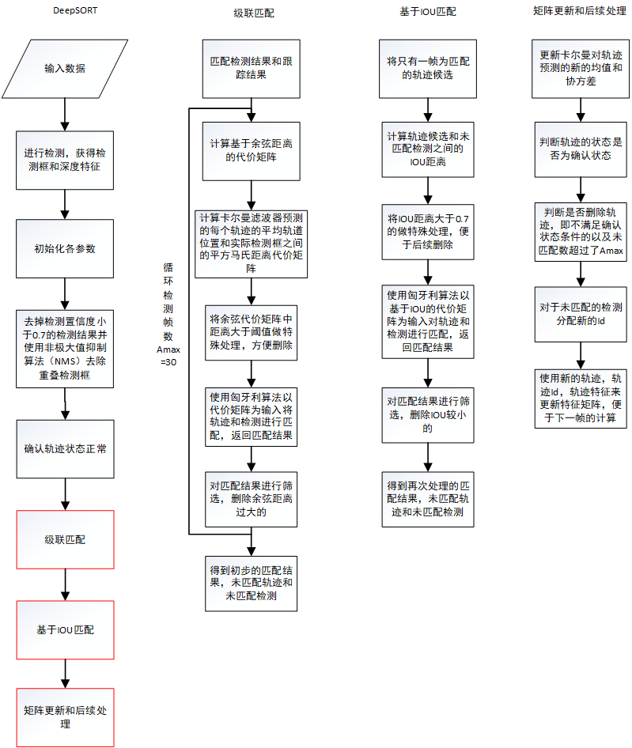
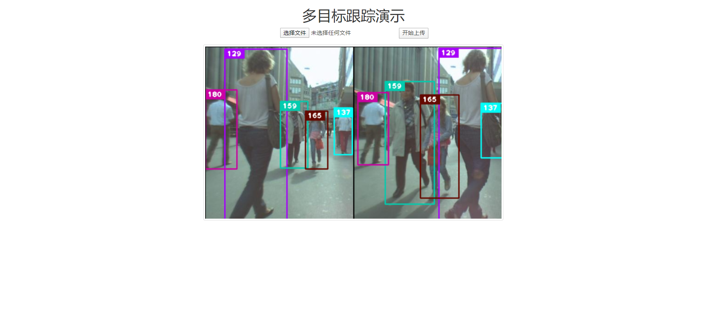
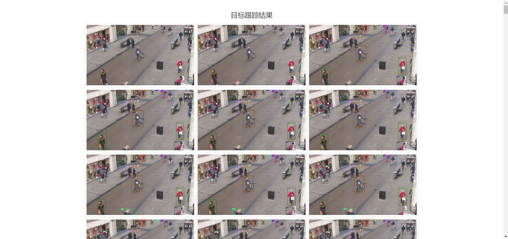

# DeepSORT 多目标跟踪算法

## 整体思路

SORT 算法的思路是将目标检测算法得到的检测框与预测的跟踪框的 iou（交并比）输入到匈牙利算法中进行线性分配来关联帧间 Id。而 DeepSORT 算法则是将目标的外观信息加入到帧间匹配的计算中，这样在目标被遮挡但后续再次出现的情况下，还能正确匹配 Id，从而减少 Id Switch。

## 算法思路

### 状态估计（state estimation）和轨迹处理（track handing）

**状态估计**

用一个 8 维空间表示轨迹在某个时刻的状态即$(u, v, \gamma, h, \dot{x}, \dot{y}, \dot{\gamma}, \dot{h})$，$(u,v)$表示 bbox 的中心坐标，$\gamma$表示宽高比，$h$表示高度，最后四个变量代表前四个变量在图像坐标中的速度信息。使用一个基于等速模型和线性观测模型的标准卡尔曼滤波器进行目标状态的预测，并将边界坐标$(u,v,\gamma,h)$作为物体状态的直接观测，预测结果为$(u,v,\gamma , h)$。

**轨迹处理**

**针对跟踪器：**
设置计数器，在使用卡尔曼滤波进行预测时递增，一旦预测的跟踪结果和目标检测算法检测的结果成功匹配，则将该跟踪器的计数器置零；如果一个跟踪器在一段时间内一直没能匹配上检测的结果，则认为跟踪的目标消失，从跟踪器列表中删除该跟踪器。

**针对新检测结果：**
当某一帧出现了新的检测结果时（即与当前跟踪结果无法匹配的检测结果），认为可能出现了新的目标，为其创建跟踪器（轨迹）。不过，仍需要观察，如果连续三帧中新跟踪器对目标的预测结果都能和某个检测结果匹配，那么确认出现了新的目标轨迹（代码实现中轨迹state置为confirmed），否则删除该跟踪器。

### 匹配问题

SORT 算法是将检测框和跟踪框的 IOU 情况作为输入，采用匈牙利算法（这是一种通过增广路径来求二分图最大匹配的一种方法），输出检测框和跟踪框的匹配结果。而 DeepSORT 为了避免大量的 Id Switch，同时考虑了**运动信息**的关联和**目标外观信息**的关联，使用融合度量的方式计算检测结果和跟踪结果的匹配程度。通过结合目标框的**马氏距离**和**特征余弦距离**两个度量来整合运动信息和外观信息，一方面，马氏距离基于运动信息，提供了有关目标的可能位置的信息，这对短期预测是有效的；另一方面，余弦距离考虑外观信息，这对长期遮挡的目标找回ID比较有效，因为此时运动不具有辨别力。

**运动信息的关联**

使用检测框和跟踪框之间的马氏距离（Mahalanobis距离）来描述运动关联程度。
$$d^{(1)}(i, j)=\left(\boldsymbol{d}_{j}-\boldsymbol{y}_{i}\right)^{\mathrm{T}} \boldsymbol{S}_{i}^{-1}\left(\boldsymbol{d}_{j}-\boldsymbol{y}_{i}\right)$$
其中，$d_j$表示第$j$个检测框的位置，$y_i$表示第$i$个跟踪器的预测框位置，$S_i$则表示检测位置与平均跟踪位置之间的协方差矩阵。马氏距离通过计算检测位置与平均轨迹位置之间的标准差来考虑状态估计的不确定性，并且通过从逆$\chi^2$分布计算$95\%$置信区间的阈值，对马氏距离进行阈值化处理来排除可能性小的关联。若某一次关联的马氏距离小于指定的阈值$t^{(1)}$，则设置运动状态关联成功，实验中设置阈值$t^{(1)}$为9.4877。
$$b_{i, j}^{(1)}=\mathbb{1}\left[d^{(1)}(i, j) \leq t^{(1)}\right]$$

**目标外观信息的关联**

当运动的不确定性很低的时候，上述的马氏距离匹配是一个合适的关联度量方法，但是在图像空间中使用卡尔曼滤波进行运动状态估计只是一个比较粗糙的预测。特别是相机存在运动时会在图像平面中引入快速位移，会使得遮挡情况下马氏距离度量非常不准确的使得关联方法失效，造成 ID switch 的现象。

因此作者引入了第二种关联方法，对每一个检测框$d_j$求一个特征向量$r_j$ (通过 REID 的 CNN 网络计算得到的对应的 128 维特征向量)，限制条件是$||rj||=1$。作者对每一个跟踪目标构建一个gallary，存储每一个跟踪目标成功关联的最近100帧的特征向量。那么第二种度量方式就是计算第$i$个跟踪器的最近100个成功关联的特征集与当前帧第$j$个检测结果的特征向量间的最小余弦距离。计算公式如下：（注意：轨迹太长，导致外观发生变化，发生变化后，再使用最小余弦距离作为度量会出问题，所以在计算距离时，轨迹中的检测数量不能太多）
$$d^{(2)}(i, j)=\min \left\{1-r_{j}^{\mathrm{T}} \boldsymbol{r}_{k}^{(i)} | \boldsymbol{r}_{k}^{(i)} \in \mathcal{R}_{i}\right\}$$
如果上面的距离小于指定的阈值，那么这个关联就是成功的。阈值是从单独的训练集里得到的，具体如下。
$$b_{i, j}^{(2)}=\mathbb{1}\left[d^{(2)}(i, j) \leq t^{(2)}\right]$$

**关联方式融合**

使用两种度量方式的线性加权作为最终的度量，超参数$\lambda$控制每个度量的权重。实验中，当存在大量的相机运动时设置$\lambda$为0是个合理的选择
$$c_{i, j}=\lambda d^{(1)}(i, j)+(1-\lambda) d^{(2)}(i, j)$$
注意：只有当两个指标都满足各自阈值条件的时候才进行融合。距离度量对短期的预测和匹配效果很好，但对于长时间的遮挡的情况，使用外观特征的度量比较有效。作者指出，对于存在相机运动的情况，可以设置$\lambda=0$。但是，马氏距离的阈值仍然生效，如果不满足第一个度量的标准，就不能进入$c_{i,j}$的融合阶段。

此时，仅当关联在两个度量的选通区域内，称其为可接受。
$$b_{i, j}=\prod_{m=1}^{2} b_{i, j}^{(m)}$$

### 级联匹配

一个目标长时间被遮挡之后，卡尔曼滤波预测的不确定性就会大大增加，状态空间内的可观察性就会大大降低。假如此时两个跟踪器竞争同一个检测结果的匹配权，往往遮挡时间较长的那条轨迹因为长时间未更新位置信息，追踪预测位置的不确定性更大，即协方差会更大，马氏距离计算时使用了协方差的倒数，因此马氏距离会更小，因此使得检测结果更可能和遮挡时间较长的那条轨迹相关联，这种不理想的效果往往会破坏追踪的持续性。

简单理解，假设本来协方差矩阵是一个正态分布，那么连续的预测不更新就会导致这个正态分布的方差越来越大，那么离均值欧氏距离远的点可能和之前分布中离得较近的点获得同样的马氏距离值。

所以，作者使用了级联匹配来对更加频繁出现的目标赋予优先权，具体算法如下图（图源自论文）。



T表示当前的跟踪状态集合，D表示当前的检测状态集合。
第一行根据公式5计算融合度量的代价矩阵；
第二行计算融合的阈值；
第三行，初始化已匹配集合为空集；
第四行初始化未匹配集合U为检测集合D；第
五行表示对跟踪状态集合从1到最大跟踪时间Amax，由近到远循环；
第六行表示根据时间选择跟踪的轨迹；
第七行表示计算最小匹配的轨迹的ID即$x_{i,j}$；
第八行表示将第七步中匹配的ID加入到M中；
第九行表示将上述ID从U中删除；
第十行表示结束循环；
第十一行表示返回最终匹配集合M和未匹配集合U。


级联匹配的核心思想就是由小到大对消失时间相同的轨迹进行匹配，这样首先保证了对最近出现的目标赋予最大的优先权，也解决了上面所述的问题。在匹配的最后阶段还对 unconfirmed和age=1的未匹配轨迹进行基于IoU的匹配。这可以缓解因为表观突变或者部分遮挡导致的较大变化。

### 深度特征提取
外观信息的获取依据一个深度特征提取网络，该网络离线训练区分度较高的特征嵌入，本项目在MARS这个著名的行人重识别数据集上训练网络，该数据集包含1261个人的超过110万张图片。

网络结构具体如下图，为宽残差网络（WRNs）。


要求输入的图像为128\*64，输出128维的特征向量。**我在使用Pytorch实现时将上述结构中的池化换成了stride为2的卷积，输出隐层换位256维特征向量，以增大一定参数量的代价试图获得更好的结果。此外，参考最近较火的EfficientNet进行优化，但算力要求过大，还在研究中。**

由于主要用于行人识别，所以在行人重识别数据集（MARS）上离线训练模型，学到的参数很适合提取行人特征，最后输出256维的归一化后的特征。

核心模型结构代码如下。
```python
class BasicBlock(nn.Module):
    def __init__(self, c_in, c_out, is_downsample=False):
        super(BasicBlock, self).__init__()
        self.is_downsample = is_downsample
        if is_downsample:
            self.conv1 = nn.Conv2d(c_in, c_out, 3, stride=2, padding=1, bias=False)
        else:
            self.conv1 = nn.Conv2d(c_in, c_out, 3, stride=1, padding=1, bias=False)
        self.bn1 = nn.BatchNorm2d(c_out)
        self.relu = nn.ReLU(True)
        self.conv2 = nn.Conv2d(c_out, c_out, 3, stride=1, padding=1, bias=False)
        self.bn2 = nn.BatchNorm2d(c_out)
        if is_downsample:
            self.downsample = nn.Sequential(
                nn.Conv2d(c_in, c_out, 1, stride=2, bias=False),
                nn.BatchNorm2d(c_out)
            )
        elif c_in != c_out:
            self.downsample = nn.Sequential(
                nn.Conv2d(c_in, c_out, 1, stride=1, bias=False),
                nn.BatchNorm2d(c_out)
            )
            self.is_downsample = True

    def forward(self, x):
        y = self.conv1(x)
        y = self.bn1(y)
        y = self.relu(y)
        y = self.conv2(y)
        y = self.bn2(y)
        if self.is_downsample:
            x = self.downsample(x)
        return F.relu(x.add(y), True)  # 残差连接


def make_layers(c_in, c_out, repeat_times, is_downsample=False):
    blocks = []
    for i in range(repeat_times):
        if i == 0:
            blocks += [BasicBlock(c_in, c_out, is_downsample=is_downsample), ]
        else:
            blocks += [BasicBlock(c_out, c_out), ]
    return nn.Sequential(*blocks)


class Net(nn.Module):
    def __init__(self, num_classes=1261, reid=False):
        """

        :param num_classes: 分类器层输出的类别数目
        :param reid: 是否为reid模式，若为True，直接返回特征向量而不做分类
        """
        super(Net, self).__init__()
        # 3 128 64
        self.conv = nn.Sequential(
            nn.Conv2d(3, 64, 3, stride=1, padding=1),
            nn.BatchNorm2d(64),
            nn.ReLU(inplace=True),
            nn.MaxPool2d(3, 2, padding=1),
        )
        # 32 64 32
        self.layer1 = make_layers(64, 64, 2, False)
        # 32 64 32
        self.layer2 = make_layers(64, 128, 2, True)
        # 64 32 16
        self.layer3 = make_layers(128, 256, 2, True)
        # 128 16 8
        self.layer4 = make_layers(256, 512, 2, True)
        # 256 8 4
        self.avgpool = nn.AvgPool2d((8, 4), 1)
        # 256 1 1 
        self.reid = reid
        self.classifier = nn.Sequential(
            nn.Linear(512, 256),
            nn.BatchNorm1d(256),
            nn.ReLU(inplace=True),
            nn.Dropout(),
            nn.Linear(256, num_classes),
        )

    def forward(self, x):
        x = self.conv(x)
        x = self.layer1(x)
        x = self.layer2(x)
        x = self.layer3(x)
        x = self.layer4(x)
        x = self.avgpool(x)
        x = x.view(x.size(0), -1)
        # B x 256
        if self.reid:
            x = x / x.norm(p=2, dim=1, keepdim=True)  # 张量单位化
            return x
        # 分类器
        x = self.classifier(x)
        return x
```

使用GPU训练50轮的结果如下。



## 流程描述
如下图，使用Visio绘制。


相比于SORT，DeepSORT主要更新就是加入了深度特征提取器和级联匹配，其余并没有太大变化，还是按照SORT那一套进行。

最后，DeepSORT算法封装的跟踪器类源码如下，其中各功能已经详细备注。
```python
import numpy as np
from . import kalman_filter
from . import linear_assignment
from . import iou_matching
from .track import Track


class Tracker:
    """
    多目标跟踪器实现
    """

    def __init__(self, metric, max_iou_distance=0.7, max_age=70, n_init=3):
        self.metric = metric
        self.max_iou_distance = max_iou_distance
        self.max_age = max_age
        self.n_init = n_init

        self.kf = kalman_filter.KalmanFilter()
        self.tracks = []
        self._next_id = 1

    def predict(self):
        """
        状态预测
        """
        for track in self.tracks:
            track.predict(self.kf)

    def update(self, detections):
        """
        状态更新
        """
        # 级联匹配
        matches, unmatched_tracks, unmatched_detections = self._match(detections)

        # Update track set.
        for track_idx, detection_idx in matches:
            # 成功匹配的要用检测结果更新对于track的参数
            # 包括
            #   更新卡尔曼滤波一系列运动变量、命中次数以及重置time_since_update
            #   检测的深度特征保存到track的特征集中
            #   连续命中三帧，将track状态由tentative改为confirmed

            self.tracks[track_idx].update(
                self.kf, detections[detection_idx])
        for track_idx in unmatched_tracks:
            # 未成功匹配的track
            #   若未经过confirm则删除
            #   若已经confirm但连续max_age帧未匹配到检测结果也删除
            self.tracks[track_idx].mark_missed()
        for detection_idx in unmatched_detections:
            # 未匹配的检测，为其创建新的track
            self._initiate_track(detections[detection_idx])
        self.tracks = [t for t in self.tracks if not t.is_deleted()]

        # Update distance metric.
        # 更新已经确认的track的特征集
        active_targets = [t.track_id for t in self.tracks if t.is_confirmed()]
        features, targets = [], []
        for track in self.tracks:
            if not track.is_confirmed():
                continue
            features += track.features
            targets += [track.track_id for _ in track.features]
            track.features = []
        self.metric.partial_fit(
            np.asarray(features), np.asarray(targets), active_targets)

    def _match(self, detections):
        """
        跟踪结果和检测结果的匹配
        :param detections:
        :return:
        """

        def gated_metric(tracks, dets, track_indices, detection_indices):
            features = np.array([dets[i].feature for i in detection_indices])
            targets = np.array([tracks[i].track_id for i in track_indices])
            cost_matrix = self.metric.distance(features, targets)
            cost_matrix = linear_assignment.gate_cost_matrix(
                self.kf, cost_matrix, tracks, dets, track_indices,
                detection_indices)

            return cost_matrix

        # 将track分为确认track和未确认track
        confirmed_tracks = [
            i for i, t in enumerate(self.tracks) if t.is_confirmed()]
        unconfirmed_tracks = [
            i for i, t in enumerate(self.tracks) if not t.is_confirmed()]

        # 将确认的track和检测结果进行级联匹配（使用外观特征）
        matches_a, unmatched_tracks_a, unmatched_detections = linear_assignment.matching_cascade(
            gated_metric, self.metric.matching_threshold, self.max_age,
            self.tracks, detections, confirmed_tracks)

        # 将上一步未成功匹配的track和未确认的track组合到一起形成iou_track_candidates于还没有匹配结果的检测结果进行IOU匹配
        iou_track_candidates = unconfirmed_tracks + [
            k for k in unmatched_tracks_a if
            self.tracks[k].time_since_update == 1]
        unmatched_tracks_a = [
            k for k in unmatched_tracks_a if
            self.tracks[k].time_since_update != 1]
        # 计算两两之间的iou，再通过1-iou得到cost matrix
        matches_b, unmatched_tracks_b, unmatched_detections = linear_assignment.min_cost_matching(
            iou_matching.iou_cost, self.max_iou_distance, self.tracks,
            detections, iou_track_candidates, unmatched_detections)

        matches = matches_a + matches_b  # 组合获得当前所有匹配结果
        unmatched_tracks = list(set(unmatched_tracks_a + unmatched_tracks_b))
        return matches, unmatched_tracks, unmatched_detections

    def _initiate_track(self, detection):
        """
        初始化新的跟踪器，对应新的检测结果
        :param detection:
        :return:
        """
        # 初始化卡尔曼
        mean, covariance = self.kf.initiate(detection.to_xyah())
        # 创建新的跟踪器
        self.tracks.append(Track(
            mean, covariance, self._next_id, self.n_init, self.max_age,
            detection.feature))
        # id自增
        self._next_id += 1
```


## 项目说明
本项目主要分为三大模块，deepsort算法模块（其中又分deep模块和sort模块），yolo3检测模块，以及web模块。最终封装为一个跟踪器模块，用于外部接口调用，该模块接受一个视频或者图片序列。

**其中，deepsort算法模块包含深度外观特征提取器的deep模块（使用Pytorch实现及训练）以及原始sort跟踪算法模块（该模块部分内容参考SORT论文源码）；yolo3检测模块调用封装好的Pytorch实现的YOLO3算法，做了本部分API的兼容；web模块则以Django为框架实现了模型的后端部署，用户通过网页提交视频，后端解析生成跟踪结果（由于机器限制，目前只返回部分帧的检测结果，实时生成依赖GPU服务器，个人电脑FPS较低。）**

具体演示如下（浏览器访问）。




直接执行脚本也可以生成跟踪后的视频文件，如下。


## 补充说明
具体代码开源于[我的Github](https://github.com/luanshiyinyang/DeepSORT)，欢迎访问。